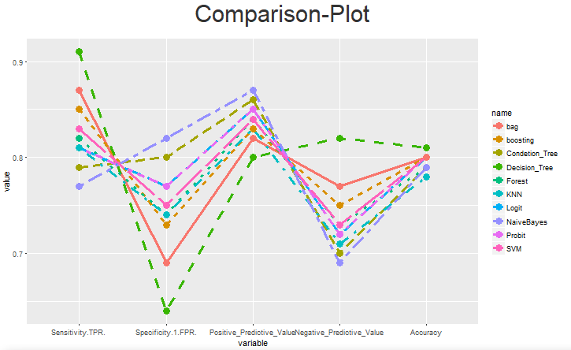

## 一个基于回归与机器学习的网页

### 简介

- 这是一个关于回归建模的网页，使用R编写完成，主要为不同回归模型的建立应用和检验
- 每一个HW（共8个）代表一个回归问题（涉及到的数据集在网页中有下载地址）
- 网址：http://cookie.shinyapps.io/research
- 具体内容：
  - 线性回归（HW1-3&5）
    - HW1：夫妻身高-----cor与cov关系
    - HW1：报纸发行-----预测与检验
    - HW2：吸烟者-------剔除无关变量
    - HW2：自行建模-----模型训练
    - HW3：吸烟者-------多元线性回归的综合应用
    - HW5：未完成
  - 岭回归（HW4：自建数据）----多重共线性
  - 机器学习与Logist/Probit（HW6：贷款信用）
    - Logist/Probit
    - 决策树（经典决策树/条件推断树）
    - 随机森林
    - 支持向量机
    - K最邻近
    - 朴素贝叶斯
    - boosting/bagging
    - 神经网络（基于python）
  - 方差分析（HW7：满意度）
  - 泊松回归（HW8：点击量）

### 关于分类：不同指标的不同分类方式的比较（截取自该网站）

